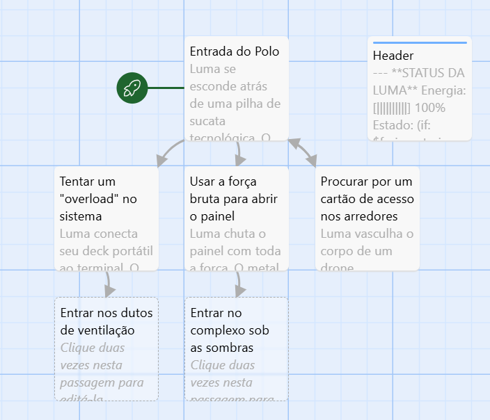

# 🛸 Projeto Luma: Bruma e Âmbar (Narrative Design Prototype)

Este é um protótipo de ficção interativa desenvolvido no **Twine (Harlowe 3.3)**. O projeto integra técnicas de dramaturgia com lógica de sistemas para demonstrar como as escolhas do jogador impactam o estado da protagonista e o ambiente ao seu redor.

## 🧠 O Conceito
Ambientado no universo distópico de *Bruma e Âmbar*, o jogador assume o papel de Luma. O foco deste protótipo é a **Narrativa Sistêmica**: as escolhas não alteram apenas o texto, mas manipulam variáveis que definem o sucesso ou fracasso de ações futuras.

## 🛠️ Implementação Técnica (Lógica de SI)
Como bacharelanda em Sistemas de Informação, utilizei conceitos de computação para estruturar a arquitetura narrativa:

* **Gerenciamento de Estado:** Uso de variáveis globais (`$ferimento`, `$possuiCartao`) para rastrear o histórico e a condição física da personagem.
* **Lógica Condicional:** Estruturas `(if:)` e `(else:)` que adaptam o mundo e os diálogos dinamicamente.
* **UI/UX Narrativa (HUD):** Implementação de um `header` funcional (CSS/HTML) que atua como um painel de status em tempo real.
* **Inicialização de Sistema:** Uso de passagens com a tag `startup` para definição de estados iniciais ($false/$true), garantindo a integridade da lógica de jogo.

## 🕹️ Como Executar
1.  Baixe o arquivo `projeto-luma.html` deste repositório.
2.  Abra o arquivo em qualquer navegador web (Chrome, Firefox ou Edge).
3.  Interaja com as opções e observe a mudança no **Status da Luma** no topo da tela.

## 📄 Estrutura do Projeto
* `/src`: Contém o código-fonte ou o arquivo .twee (opcional).
* `luma.html`: Arquivo compilado e jogável.
* **Fluxograma:** O design visual das passagens e ramificações pode ser visualizado na raiz do projeto.

---
**Autora:** Maysa Santos  
*Escritora, Roteirista e Bacharelanda em Sistemas de Informação.* *Foco em Narrative Design e Worldbuilding.*